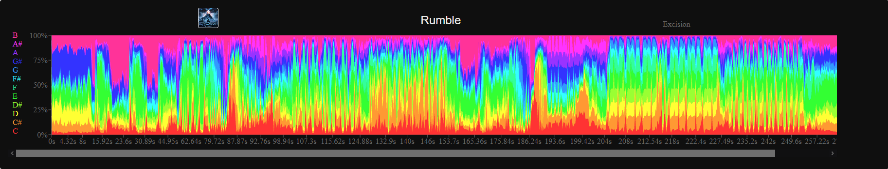
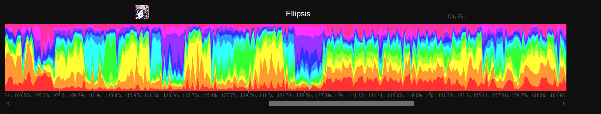
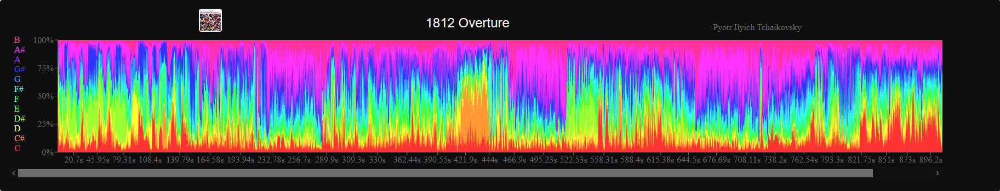

# Song Visualition

A link to the live app will go here soon.

------------

#### Visualize the relative dominance of pitches throughout any track on Spotify!
Pitches are organized into 12 classes -- C, C#, D, D#, E, F and so on. 
This is known as the chromatic scale.

This web app uses the Spotify API to visualize an audio analysis for virtually any song.

Zoom in to find specific chords 

Zoom out to recognize chorus structures

------------

#### Explore several featured tracks or search for your own favorites!

------------
###### Bugs? Requests? Ideas?  
Open an issue or shoot me an email: dahlx595@umn.edu

